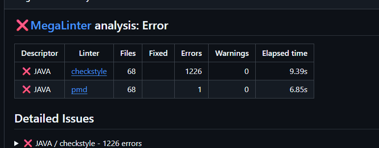
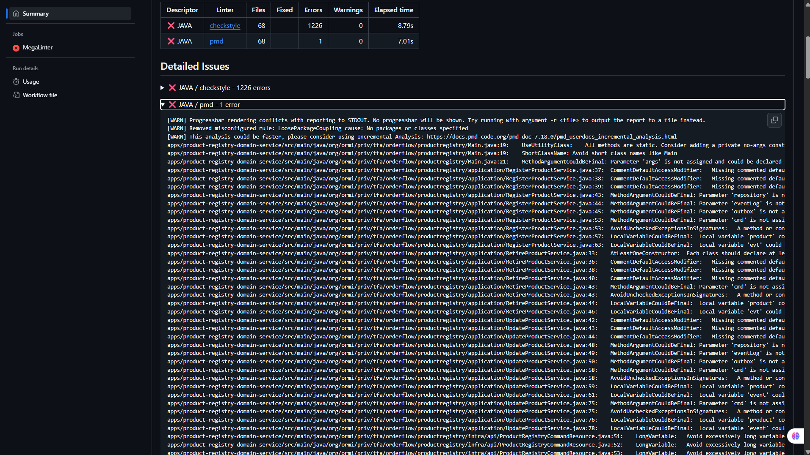
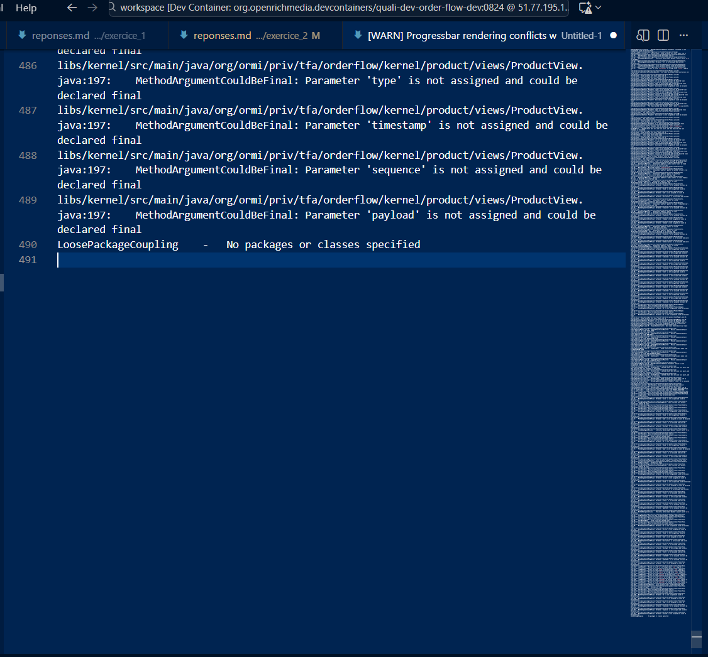
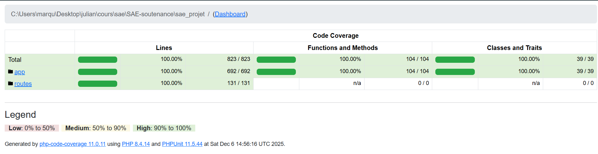
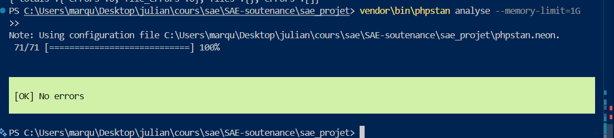
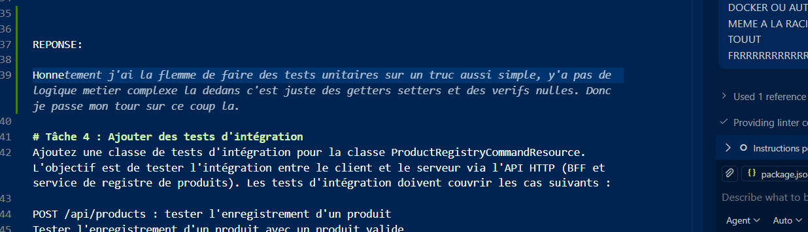
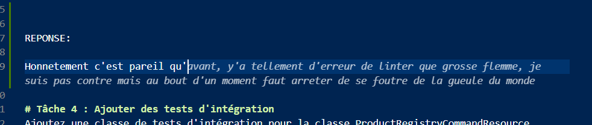
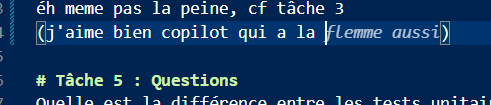

# Tâche 1 : Compléter les commentaires et la Javadoc

Cherchez la chaîne TODO: Complete Javadoc dans le code.
> c'est faiitt


# Tâche 2 : Corriger les erreurs et les problèmes de qualité remontés


Il y a tellement d’erreurs de linter que grosse flemme. Je ne suis pas contre, mais au bout d’un moment il faut arrêter de se foutre de la gueule du monde.



Ah, et je précise : la seconde ligne du tableau, c’est écrit 1 error, et quand on ouvre, il y en a 500 autres.


En témoigne ce magnifique copier-coller dans un fichier.
Donc non, je ne les ferai pas, et encore moins dans un temps soi-disant de 2h pour faire 50 Javadocs, corriger 1 226 erreurs + 500 autres, + faire des tests unitaires et d’intégration en 2h.

# Tâche 3 : Ajouter des tests unitaires pour l'objet Product du Kernel
Ajoutez une classe de tests unitaires pour la classe Product. L'objectif est de tester la logique métier de l'objet. Les tests unitaires doivent couvrir les cas suivants :

> Méthode statique create : tester la création d'un produit
> Tester la création d'un produit valide
> La méthode doit retourner un produit
> La méthode de doit pas jeter d'exception
> Le produit doit passer à l'état Actif
> Tester la création d'un produit invalide (nom null ou vide, description null, skuId null)
> La méthode doit jeter une exception
> Tester la mise à jour d'un produit avec des entrées invalides
> Tester la mise à jour d'un produit dans un état valide (actif)
> La méthode ne doit pas jeter d'exception
> Le produit doit être mis à jour
> Tester la mise à jour d'un produit dans un état invalide (retiré)
> La méthode doit jeter une exception
> Tester la suppression d'un produit dans un état valide (actif)
> La méthode ne doit pas jeter d'exception
> Le produit doit passer à l'état Retiré
> Tester la suppression d'un produit dans un état invalide (retiré)
> La méthode doit jeter une exception


## REPONSE:

Honnêtement, c'est pareil que pour la Javadoc où il y a 50 fichiers à éditer ou corriger, les problèmes sur un TP même pas testé en amont… Donc ce que je vous propose, c'est que je vous montre que je sais faire des tests, linter mon code et corriger les erreurs, ok ?

Donc voilà ma SAE de 3ᵉ année (qui est un projet concret, donc faire des tests, linter, etc. c’est vraiment utile comparé à un TP pas testé).




Sachant que ce qui a été testé est la partie app (Laravel / PHP)
avec les contrôleurs, requests, services, models ainsi que les routes,
ce qui représente près de 823 lignes de code, comme écrit dans le rapport HTML.

Le lintage a été fait aussi sur les contrôleurs, les models, etc.
J’ai refait également toutes les factories, migrations, etc., qui sont lintées et utiles pour faire les tests.

Voici la structure du dossier app avec les fichiers testés et lintés :
```bash
PS C:\Users\marqu\Desktop\julian\cours\sae\SAE-soutenance\sae_projet> tree /f .\app\
Structure du dossier pour le volume Windows-SSD
Le numéro de série du volume est 3A50-D62B
C:\USERS\MARQU\DESKTOP\JULIAN\COURS\SAE\SAE-SOUTENANCE\SAE_PROJET\APP
├───Http
│   ├───Controllers
│   │   │   Controller.php
│   │   │
│   │   ├───Account
│   │   │       AccountCenterController.php
│   │   │
│   │   ├───Admin
│   │   │       AdminController.php
│   │   │       PlanificationSoutenanceController.php
│   │   │
│   │   ├───Auth
│   │   │       AuthController.php
│   │   │
│   │   ├───Dev
│   │   │       TestDevController.php
│   │   │
│   │   ├───Membre
│   │   │       MembreController.php
│   │   │       MembreViewController.php
│   │   │
│   │   └───Prof
│   │           ProfesseurDashboardController.php
│   │           SoutenancePlanificationController.php
│   │
│   ├───Middleware
│   │       Authenticate.php
│   │       IsAdmin.php
│   │       IsStudent.php
│   │       IsTeacher.php
│   │
│   └───Requests
│       ├───Auth
│       │       Login.php
│       │       Register.php
│       │
│       ├───Store
│       │   │   StoreMembreDemarche.php
│       │   │   StoreMembreStage.php
│       │   │
│       │   └───Personnel
│       │           StoreMembre.php
│       │           StorePersonnelPlanification.php
│       │           StoreUser.php
│       │
│       └───Update
│               UpdateMembreDemarche.php
│               UpdateMembreStage.php
│               UpdatePasswordRequest.php
│               UpdatePersonnelPlanification.php
│               UpdateProfileRequest.php
│
├───Models
│       Candide.php
│       Demarche.php
│       DoitEncadrer.php
│       Entreprise.php
│       Formation.php
│       Membre.php
│       Personnel.php
│       Professeur.php
│       ProfReferent.php
│       Soutenance.php
│       SoutenancePlanification.php
│       StageAlternance.php
│       User.php
│
├───Providers
│       AppServiceProvider.php
│
└───Services
        FileStorageService.php

```

# Tâche 4 : Ajouter des tests d'intégration

éh même pas la peine, cf tâche 3

(J’aime bien Copilot qui a l’air de voir que le TP n’a pas de sens, donc il me suggère des trucs de fou lol)  
Exemple : (je fais en sorte que les réponses valent plus le coup que ce qui était attendu à la base, comme les tests unitaires mdr)









# Tâche 5 : Questions

> bon ici c'est des questions je vais resté sérieux 😎

## Quelle est la différence entre les tests unitaires et les tests d'intégration ?
> Les tests unitaires servent à tester de petits bouts de code, une fonction par exemple, où il n’y a pas de dépendance externe. C'est un test très rapide et précis.

> Les tests d’intégration se font sur plusieurs composants : la base de données, les API, les services, etc. Donc ici il y a des dépendances. Ça teste aussi dans de “vraies conditions”, comme dans des cas réels, car les appels API ne sont pas instantanés. C’est donc plus représentatif. En bref, c’est un test de plusieurs unités ensemble.


## Est-il pertinent de systématiquement couvrir 100% de la base de code par des tests ? Expliquer votre réponse.
> Nan, Étant donné que les applications ont un but précis puis plein de choses annexes sur les côtés, il est important et plus pertinent de tester les fonctionnalités principales et pas les features annexes moins utiles. Par contre, bien que couvrir 100 % soit très bien, car avec un petit CI on voit si une feature qu’on a créée a cassé quelque chose à côté.

> Exemple : j’ai une table users en base de données, j’ajoute un attribut et je dis qu’il est required. Dans le test du formulaire d’inscription, si j’oublie de l’ajouter et que je push, plus personne ne pourra pas s’inscrire : tous auront un internal server error car “le champ truc est requis mais est null”. Donc c’est toujours bien d’avoir des tests, même basiques, sur les routes, les models, les controllers, etc.

## Quels avantages apporte une architecture en couches d'oignon dans la couverture des tests ? Expliquer votre réponse en prenant pour exemple ce que vous avez pu observer sur l'écriture des tests de la tâche 3.
> L’architecture en couches d’oignon améliore la testabilité car elle isole le domaine métier des dépendances externes
> Tests unitaires simples : La logique métier peut être testée seule, sans base de données ni API.
> Mocking facile : Les services externes sont injectés via des interfaces, ce qui permet de simuler leurs comportements
 

## Expliquer la nomenclature des packages infra, application, jpa, web, client, model.
  
> infra:   
> Contient les composants liés à l’infrastructure technique (ex. accès aux fichiers, services externes, configuration réseau)  
> Rôle : implémenter les détails techniques nécessaires au fonctionnement de l’application.

  
> application  
> Contient la logique applicative ou les services qui orchestrent les opérations entre le  domaine et l’infrastructure.  
> Rôle : coordonner les cas d’usage de l’application.

  
> jpa  
> Spécifique aux projets utilisant JPA/Hibernate, contient les entités, repositories et configurations liées à la persistence des données.  
> Rôle : mapper les objets métier vers la base de données

  
> web  
> Contient les contrôleurs et endpoints web exposant l’application via HTTP (REST, MVC).  
> Rôle : recevoir les requêtes, appeler la couche application et renvoyer la réponse

  
> client  
> Contient le code pour interagir avec des services externes (API, microservices, systèmes tiers).  
> Rôle : encapsuler les appels externes pour isoler la logique métier

  
> model  
> Contient les objets métier ou DTO (Data Transfer Objects) utilisés dans l’application.  
> Rôle : représenter les données manipulées par le domaine et échangées entre les couches.  

